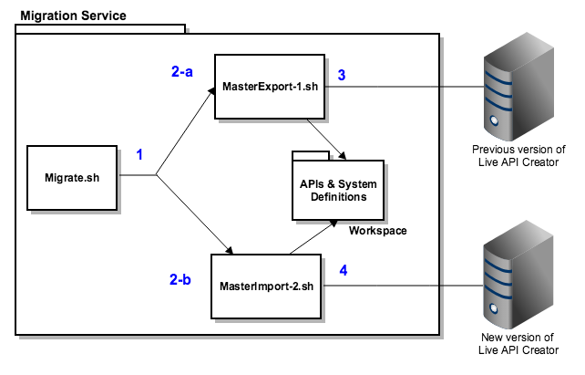

# Migration Service Script Generator
The migration service is a utility written in Java to help DevOps create and run command line scripts to aid in
the export/import between Live API Creator (LAC) versions. The shell program prompts for the source LAC server host
and the system and TeamSpace user/password. The output is a command line script to export all of your source server components. It also generates a script to import these components to the new Live API Creator server. You can modify the generated scripts to reflect the correct host server, user/passwords, and perhaps database data source passwords. If you have multiple TeamSpace entries, initialize the LAC 5.0 server to support each new TeamSpace instances with a default user.
## Prerequisites
Ensure that you have Java installed (the main service is a Java class). You might need to install GIT and ZIP command line tools. If you download the ZIP version, then unzip the MigrationService-master.zip file. 
```aidl
* java JDK 8
* git command line 
* zip utilities
```

## Clone this Repository to a Directory on your System
```
git clone https://github.com/EspressoLogicCafe/MigrationService.git ~/MigrationService

Change directory.

cd ~/MigrationService
Note: you may need to change the permissions of this directory to allow execute of the scripts.
```
### (optional) clean and compile step
If you make a change the MigrationService java file - you can recompile the WAR using maven.
Make sure you have [Maven](https://maven.apache.org/download.cgi) installed.
```
mvn clean install
```

## (Optional) Compile this Package
This step is optional.  It should run out-of-the-box.  However, if you decide to modify the source
code (/src/main/java/MigrationService.java) simply run this command to recompile and create a new MigrationService.jar file.

```
mvn clean install
```

## To Run MAC OSX or Linux
Make sure that your source system has been started and that you can connect from this server.
Create two sets of users (sa and admin) and two sets of passwords for each of these users. 
Create test for each set using the 'lacadmin login' command. (e.g. macos/lacadmin login -u sa -p Password1 http://localhost:8080)

```
MigrationService usage:
 arg1 = host name and port (default: http://localhost:8080)
 arg2 = admin user (default: sa)
 arg3 = admin password (default: Password1) 
 arg4 = target TeamSpace user (default: admin) 
 arg5 = target TeamSpace password (default: Password1)
 
sh migrate.sh http://localhost:8080 sa Password1 admin Password1
You have additional TeamSpace entries in your source system.
Remember to modify your MasterExport-1.sh and your MasterImport-2.sh scripts for [teamspaceUser] and [teamspacePassword]

```

## To Run Windows

```
MigrationService usage:
 arg1 = host name and port (default: http://localhost:8080)
 arg2 = admi user (default: sa)
 arg3 = admin password (default: Password1) 
 arg4 = target TeamSpace user (default: admin) 
 arg5 = target TeamSpace password (default: Password1)
 
migrate.cmd http://localhost:8080 sa Password1 admin Password1 
Remember to modify your MasterExport-1.sh and your MasterImport-2.sh scripts for [teamspaceUser] and [teamspacePassword]

```
## (Optional) Install NodeJS & Admin CLI
The command-line tool lacadmin is written in NodeJS. This package contains compiled (pkg) versions of the command-line tool for multiple platforms ([macos/lacadmin | linux/lacadmin | windows/lacadmin.exe]).  
To see the source code and use the NodeJS package, install Node, NPM, and the lacadmin command-line tools.  
Then modify your scripts to use 'lacadmin' as the global command instead of the package/compiled version.
For more information, see (liveapicreator-admin-cli)[https://www.npmjs.com/package/liveapicreator-admin-cli].
```aidl
$npm install liveapicreator-admin-cli -g
```

## 1 -Script Export MasterExport-1[.ext]
Look for a file named MasterExport-1[.extension] where extension is .sh or .cmd. The '[platform]/lacadmin' command is a compiled version of the NodeJS command line tool [liveapicreator-devops (https://github.com/EspressoLogicCafe/liveapicreator-devops).

The export shell script creates a series of JSON files which the MasterImport-1 shell script uses. 
Running the script places all your files in the workspace directory.

```
# ===============================================================
#  EXPORT SCRIPT
#  Please change script [teampsaceUser] and [teamspacePassword]
#  if you have more than 1 TeamSpace in your source system
# ===============================================================
# OS: Mac OS X
# Found Teamspace name: default TeamSpace url_name: default ident: 2000
# Found Teamspace name: QA TeamSpace url_name: qa ident: 2001
# 
# Start Export TeamSpace ident:2000
macos/lacadmin logout
macos/lacadmin login -u admin -p Password1 http://localhost:8080
# macos/lacadmin teamspace exportRepos --file AllProjects2000.zip --format zip  --passwordstyle plaintext
macos/lacadmin authprovider export --ident 2001 --file 'workspace/AUTHPROVIDER_JSAuth_2000.json' 
macos/lacadmin managedserver export --ident 2000 --file 'workspace/MANAGEDSERVER_Demo_managed_data_server_2000.json' 
macos/lacadmin managedserver export --ident 2001 --file 'workspace/MANAGEDSERVER_New_managed_data_server_2000.json' 
macos/lacadmin gateway export --ident 2000 --file 'workspace/GATEWAY_New_CA_API_Gateway_jpzsg_2000.json' 
macos/lacadmin gateway export --ident 2000 --file 'workspace/GATEWAY_New_CA_API_Gateway_jpzsg_2000.json' 
macos/lacadmin api export --url_name demo --file 'workspace/PROJECT_Demo_2000.json' --passwordstyle plaintext --format json
```

## 2 - Script Import MasterImport-2[.ext]
Look for a file named MasterImport-2[.extension] where extension is .sh or .cmd.  Modify the lacadmin login to reflect the correct server and TeamSpace user/password. If you have multiple TeamSpaces, create each TeamSpace and default user, 
then modify the import script to point to your new LAC 5.0 server. When you run the script, the source files are in the workspace directory.

**NOTE:** Start your target server, and then accept the end user license agreement (EULA). If you have multiple TeamSpaces, you must create each TeamSpace and user (then modify the MasterImport-2 script).

```
# ================================================================
#  IMPORT SCRIPT
#  Change script [teampsaceUser] and [teamspacePassword]
#  if you have more than 1 TeamSpace in your source system
#  
#  Start your target server first
#  and manually create each TeamSpace and user/password 
# ================================================================
macos/lacadmin logout
macos/lacadmin login -u admin -p Password1 http://localhost:8080
# Start Import TeamSpace ident:2000
macos/lacadmin authprovider import  --file 'workspace/AUTHPROVIDER_JSAuth_2000.json'
macos/lacadmin managedserver import  --file 'workspace/MANAGEDSERVER_Demo_managed_data_server_2000.json'
macos/lacadmin managedserver import  --file 'workspace/MANAGEDSERVER_New_managed_data_server_2000.json'
macos/lacadmin gateway import  --file 'workspace/GATEWAY_New_CA_API_Gateway_jpzsg_2000.json'
# Start import
# macos/lacadmin api import --file workspace/AllProjects2000.zip --namecollision replace_existing
macos/lacadmin api import  --file 'workspace/PROJECT_Demo_2000.json' --namecollision replace_existing

```
**Note:** Linux generates two login commands. This is caused by a defect in the lacadmin compiled version.
## Workspace
The workspace directory contains your APIs from your source system when you execute the MasterExport-1 script.
The MasterImport-1 script uses the workspace as input to the new version of your LAC server.

## Multiple TeamSpaces
If you have multiple TeamSpace accounts, you must edit both the export and import scripts and enter the correct 
[teamspaceUser] and [teampspacePassword]. For the Live API Creator 5.0 target server, create the TeamSpace and TeamSpace user before you run the import scripts.
```aidl
#  === REMEMBER TO CHANGE THE [teamspaceUser] and [teamspacePassword] for each TeamSpace instance. =====
macos/lacadmin logout
macos/lacadmin login -u [teampsaceUser] -p [teamspacePassword] http://localhost:8080

```

### Data source passwords
In Live API Creator 4.x and earlier, the JSON file export did not include data source passwords.  
The export script attempts to generate and use the encrypted password and salt from the source server. 
If the script fails to reset the password, remove the --salt and change the --password to the plaintext version.
```
macos/lacadmin api import  --file 'PROJECT_GM_Ftp_Server_POC.json'
macos/lacadmin api use --url_name ftp 
macos/lacadmin datasource update  --password '2:B+G5IeItRuvCaEaJ8kgqD20d+XzMcUvR1/qi52bSx4u/goWsWHu5pg==' --salt 'RARPUGjlC3yjuTfm6/hxdxeJnQ3nWh/YNCNWWeJE' --prefix main
```

## Auth Provider Code Changes
In 5.0, if you have written a custom JavaScript authentication provider, the JavaScript code is now included with the auth provider itself.
In Live API Creator 4.x and earlier, the API holds a library entry that the API uses. To manually migrate the code, you can cut and paste the code from a single API library and paste it into the TeamSpace Javascript authentication provider.
You can use the following commands to find the specific library (list) ident to export the code and import into the authentication provider.
```
macos/lacadmin api use --url_name demo
macos/lacadmin libraries list
macos/lacadmin libraries exportJavascript --file myLDAPAuthprovider.js --ident 2001
macos/lacadmin authprovider importJSCode --file myLDAPAuthprovider.js --auth_name JSAuthProvider
```
## Troubleshooting
If you do not modify your scripts (MasterExport-1 or MasterImport-2) to reflect your TeamSpace username or password,
the logon fails and a message similar to the following appears. Make sure that both the export and import scripts reflect the accurate username and password for each additional TeamSpace. Also, make sure that your target server is running and you
have 

```aidl
MasterExport-1.sh: line 55: teampsaceUser: No such file or directory
fs.js:646
  return binding.open(pathModule._makeLong(path), stringToFlags(flags), mode);
                 ^

Error: ENOENT: no such file or directory, open '/Users/banty01/.liveapicreator/admin/currentServer.txt'
    at Object.fs.openSync (fs.js:646:18)
    at Object.fs.openSync (pkg/prelude/bootstrap.js:483:32)
    at Object.fs.readFileSync (fs.js:551:33)
    at Object.fs.readFileSync (pkg/prelude/bootstrap.js:679:36)
    at Object.getCurrentServer (/snapshot/CALiveAPICreatorAdminCLI/util/dotfile.js:0:0)
    at Object.login (/snapshot/CALiveAPICreatorAdminCLI/util/login.js:0:0)
    at Object.export (/snapshot/CALiveAPICreatorAdminCLI/objects/managedserver.js:0:0)
    at Command.doDbase (/snapshot/CALiveAPICreatorAdminCLI/objects/managedserver.js:0:0)
    at Command.listener (/snapshot/CALiveAPICreatorAdminCLI/node_modules/commander/index.js:315:8)
    at emitTwo (events.js:126:13)
fs.js:646
  return binding.open(pathModule._makeLong(path), stringToFlags(flags), mode);
```
